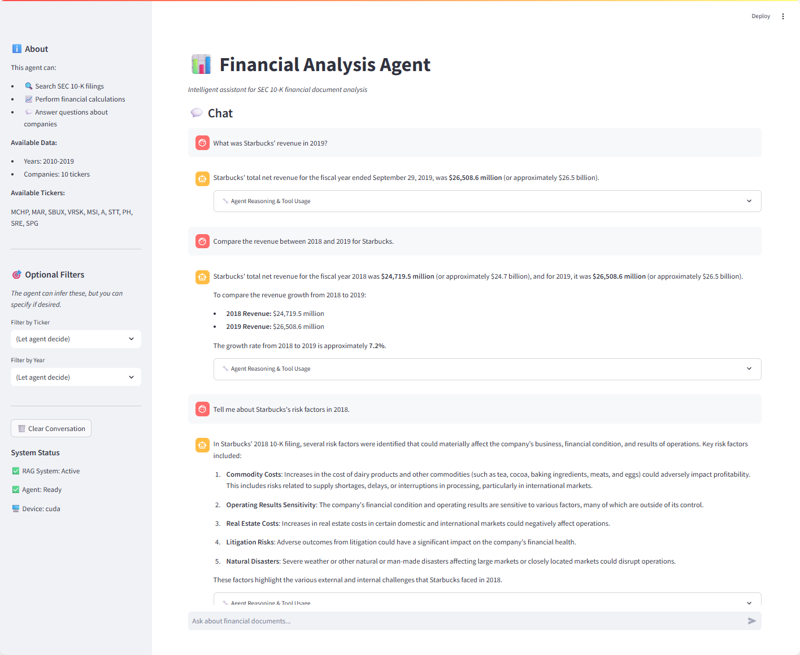

# Financial Analysis Agent

A LangChain-powered intelligent agent for analyzing SEC 10-K financial filings with RAG-based document retrieval and financial calculation capabilities.

---

## Table of Contents

1. [Overview](#overview)
2. [System Architecture](#system-architecture)
3. [Source Code Overview](#source-code-overview)
4. [Execution Logic](#execution-logic)
5. [Demonstration with Screenshot](#demonstration-with-screenshot)
6. [Data and Processing](#data-and-processing)
7. [Vector Store Construction](#vector-store-construction)
8. [RAG Pipeline Implementation](#rag-pipeline-implementation)
9. [Agent Implementation](#agent-implementation)
10. [Tools](#tools)
11. [Setup & Usage](#setup--usage)
12. [Example Interactions](#example-interactions)
13. [Limitations & Future Work](#limitations--future-work)

---

## Overview

This project implements an intelligent, agent-based system for analyzing SEC Form 10-K financial filings using Retrieval-Augmented Generation (RAG). The system enables users to ask natural language questions about company financials and receive grounded, well-sourced answers derived directly from historical regulatory filings.

At its core, the system combines a large language model with a persistent vector database and a set of specialized tools. Rather than relying on parametric knowledge alone, the agent dynamically retrieves relevant document fragments from a curated corpus of SEC filings and reasons over them to produce accurate, transparent responses.

The agent is capable of:
- Searching and extracting factual information from SEC 10-K filings
- Performing multi-step financial analysis using retrieved data
- Executing numerical calculations such as growth rates, margins, and ratios
- Explaining results in clear, human-readable financial language
- Explicitly stating when requested information is unavailable

The system is built using the following core technologies:

- **LangChain** for agent orchestration, tool invocation, and ReAct-style reasoning
- **OpenAI `gpt-4o-mini`** for deterministic, cost-efficient reasoning and response generation
- **ChromaDB** as a persistent vector store for scalable similarity-based document retrieval
- **HuggingFace sentence-transformer embeddings** (`all-mpnet-base-v2`) for semantic document representation
- **Streamlit** for an interactive, web-based chat interface

The underlying dataset consists of SEC Form 10-K filings from 10 publicly traded companies, which are sampled from the S\&P 500 companies—MCHP, MAR, SBUX, VRSK, MSI, A, STT, PH, SRE, and SPG—covering fiscal years 2010 through 2019. Each filing is cleaned, chunked, embedded, and stored with structured metadata (company ticker and fiscal year), enabling precise, filtered retrieval.

---

## System Architecture

```
┌─────────────────────────────────────────────────────────────────┐
│                     Streamlit Chat Interface                    │
│                           (app.py)                              │
└─────────────────────────────────────────────────────────────────┘
                              │
                              ▼
┌─────────────────────────────────────────────────────────────────┐
│                     LangChain Agent                             │
│                        (agent.py)                               │
│  ┌─────────────────┐  ┌─────────────────┐  ┌─────────────────┐  │
│  │   OpenAI LLM    │  │   Prompt        │  │ Agent Executor  │  │
│  │  (gpt-4o-mini)  │  │   Template      │  │  (ReAct Loop)   │  │
│  └─────────────────┘  └─────────────────┘  └─────────────────┘  │
└─────────────────────────────────────────────────────────────────┘
                              │
              ┌───────────────┴───────────────┐
              ▼                               ▼
┌─────────────────────────┐     ┌─────────────────────────┐
│   Financial Document    │     │   Financial Calculator  │
│      Search Tool        │     │         Tool            │
│  (tools/rag_tool.py)    │     │ (tools/calculator_tool) │
└─────────────────────────┘     └─────────────────────────┘
              │
              ▼
┌─────────────────────────────────────────────────────────────────┐
│                   RAG System (system.py)                        │
│  ┌─────────────────┐  ┌─────────────────┐  ┌─────────────────┐  │
│  │   HuggingFace   │  │    ChromaDB     │  │   Similarity    │  │
│  │   Embeddings    │  │  Vector Store   │  │  Postprocessor  │  │
│  │  (all-mpnet-    │  │  (persistent)   │  │   (reranking)   │  │
│  │   base-v2)      │  │                 │  │                 │  │
│  └─────────────────┘  └─────────────────┘  └─────────────────┘  │
└─────────────────────────────────────────────────────────────────┘
                              │
                              ▼
┌─────────────────────────────────────────────────────────────────┐
│                    SEC 10-K Documents                           │
│              (10 companies, 2010-2019)                          │
└─────────────────────────────────────────────────────────────────┘
```

### Component Summary

| Component | File | Purpose |
|-----------|------|---------|
| Chat Interface | `app.py` | Streamlit web UI for user interaction |
| Agent | `agent.py` | LangChain agent with ReAct loop |
| Search Tool | `tools/rag_tool.py` | RAG-based document retrieval |
| Calculator Tool | `tools/calculator_tool.py` | Financial calculations |
| RAG System | `system.py` | Vector search and retrieval |
| Configuration | `config.py` | API keys and model settings |

---

## Source Code Overview

The project follows a modular, layered architecture that cleanly separates user interface logic, agent reasoning, retrieval infrastructure, and data processing. Each component has a single responsibility, enabling easier debugging, testing, and future extensions.

### Core Application Files

| File | Description |
|------|-------------|
| `app.py` | Streamlit-based chat interface and application entry point |
| `agent.py` | LangChain agent definition, prompt template, and execution loop |
| `system.py` | RAG retrieval system (vector search, filtering, reranking) |
| `config.py` | Centralized configuration for models, API keys, and file paths |

### Data Pipeline Files

| File | Description |
|------|-------------|
| `sample_tickers.py` | Samples 10 tickers from S&P 500 companies |
| `data_downloading.py` | Downloads SEC 10-K filings for sampled companies from the `EDGAR` system |
| `data_processing.py` | Cleans raw 10-K filings: HTML parsing, content filtering, metadata tagging |
| `vector_store_construction.py` | Chunks documents, generates embeddings, and persists them in ChromaDB |

### Data Directory Structure

```
data/
├── original/ # Raw SEC filings downloaded via data_downloading.py
├── processed/ # Cleaned text files generated by data_processing.py
└── vector_store/ # Persistent ChromaDB storage created by vector_store_construction.py
```

### Tool Implementations

| File | Description |
|------|-------------|
| `tools/rag_tool.py` | RAG-based document search tool exposed to the agent |
| `tools/calculator_tool.py` | Financial calculator tool for numeric reasoning |

### Environment Configuration

The project uses environment variables for API configuration. An example is provided in the `.env.example` file.

### Documentation

| File | Description |
|------|-------------|
| `WORKFLOW_REPORT.md` | System design, implementation details, and usage documentation |

---

## Execution Logic

This section describes the end-to-end execution flow of the system, from application startup to final answer generation.

---

### 1. Application Startup

The system is launched using:

```bash
streamlit run app.py
```

At startup, the following steps occur:

1. Environment variables are loaded from the `.env` file
2. A persistent `RAGSystem` instance is initialized
3. A LangChain agent is created and cached in Streamlit session state

This design ensures that:

- The vector store is loaded only once per session
- Expensive initialization steps are not repeated across queries

---

### 2. User Query Handling (UI Layer)

The user interaction flow proceeds as follows:

1. The user submits a natural language question via the Streamlit chat UI
2. Optional context (ticker and/or year) may be appended as natural language hints
3. The full prompt is forwarded unchanged to the agent

**Design choice:**  
The UI does not perform retrieval or filtering logic. All decision-making is delegated to the agent and the RAG system.

---

### 3. Agent Reasoning and Tool Selection

Upon receiving a query, the agent performs the following steps:

1. The LLM analyzes the user question
2. It determines whether factual document retrieval is required
3. It invokes the `search_financial_documents` tool when external knowledge is needed
4. If numeric computation is required, it invokes the `financial_calculator` tool

The agent follows a ReAct-style reasoning loop:
```
Thought → Tool Call → Observation → Thought → Final Answer
```

This enables multi-step reasoning and transparent tool usage.

---

### 4. RAG Retrieval Logic (System Layer)

When the `search_financial_documents` tool is invoked, the RAG system executes
the following pipeline:

1. The query is augmented with the company ticker to strengthen semantic grounding
2. A strict retrieval attempt is made using both `ticker` and `year`
3. If no results are found, the system automatically relaxes the year constraint
4. Vector similarity search is performed using ChromaDB
5. Retrieved chunks are reranked using a similarity postprocessor
6. The highest-ranked nodes are returned to the agent

This fallback strategy avoids false negatives caused by fiscal year versus
filing year mismatches in SEC data.

---

### 5. Answer Synthesis

After retrieval:

1. The agent receives the retrieved document snippets
2. It synthesizes a concise, grounded answer using the LLM
3. The final response is rendered in the Streamlit chat interface
4. Intermediate tool calls may be displayed for transparency

If no relevant documents exist, the agent explicitly states that the information
is unavailable rather than hallucinating an answer.

---

### 6. Execution Summary Diagram

```
User Query
↓
Streamlit UI (app.py)
↓
LangChain Agent (agent.py)
↓
RAG Tool (rag_tool.py)
↓
Vector Retrieval (system.py + ChromaDB)
↓
Reranking & Context Assembly
↓
LLM Answer Generation
↓
Final Response to User
```

---
## Demonstration with Screenshot



The screenshot demonstrates the core capabilities of the Financial Analysis Agent:

- **Information Retrieval:** Accurately retrieves factual information from SEC 10-K filings (e.g., company revenues and risk disclosures) using a RAG-based document search pipeline.
- **Financial Calculation:** Performs numerical analysis such as revenue growth calculations across multiple fiscal years.
- **Multi-step Reasoning:** Combines document retrieval and calculation tools to answer comparative and analytical questions.
- **Accuracy Verification:** All responses are grounded in retrieved filing content, and the agent avoids hallucination when information is unavailable.

This example illustrates how the assistant supports reliable, transparent financial analysis through integrated retrieval and reasoning.

---

## Data and Processing

### Original Data

SEC Form 10-K filings were downloaded using the `sec_edgar_downloader` tool for 10 companies sampled from the S\&P 500 through `sample_tickers.py` across 10 years (2010-2019), resulting in ~100 filings.

**Sampled Companies:**

| Ticker | Company |
|--------|---------|
| MCHP | Microchip Technology |
| MAR | Marriott International |
| SBUX | Starbucks Corporation |
| VRSK | Verisk Analytics |
| MSI | Motorola Solutions |
| A | Agilent Technologies |
| STT | State Street Corporation |
| PH | Parker Hannifin |
| SRE | Sempra Energy |
| SPG | Simon Property Group |

**Original Directory Structure:**
```
data/original/
  sec-edgar-filings/
    {TICKER}/
      10-K/
        {FilingFolder}/
          full-submission.txt    # Raw HTML content
```

### Processed Data

Each filing is cleaned and stored in a standardized format.

**Processed Directory Structure:**
```
data/processed/
  {TICKER}_{YYYY}/
    content.txt    # Cleaned text content
```

### Data Processing Workflow

**Step 1: Extraction**
- Filing year extracted from folder name using regex pattern (e.g., `-19-` → 2019)
- Processed directories created with `{TICKER}_{YEAR}` naming convention
- Raw HTML content read from `full-submission.txt`

**Step 2: Cleaning (`clean_10k_content` function)**
- Remove non-printable/control characters
- Strip HTML tags using BeautifulSoup (`script`, `style`, `meta` removed)
- Remove SEC boilerplate headers/footers (e.g., "UNITED STATES SECURITIES AND EXCHANGE COMMISSION", "FORM 10-K")
- Process tables: retain content tables, remove empty cells
- Preserve section headers (e.g., "ITEM 1. BUSINESS", "ITEM 1A. RISK FACTORS")
- Normalize whitespace: collapse multiple spaces, condense excessive newlines

**Step 3: Storage**
- Cleaned content saved as `content.txt` in corresponding `{TICKER}_{YEAR}` directory

---

## Vector Store Construction

### Chunking Strategy

| Parameter | Value | Rationale |
|-----------|-------|-----------|
| Chunk Size | ~512 tokens | Balances context size and embedding efficiency |
| Overlap | 50 tokens | Maintains context continuity at chunk boundaries |
| Splitter | SentenceSplitter | Ensures semantically complete units |

**Chunking Process:**
1. Text divided into sentences using `SentenceSplitter`
2. Sentences accumulated until ~512 token limit reached
3. Current chunk finalized, next chunk initialized with 50-token overlap
4. Each chunk converted to `TextNode` for vector storage

### Document Embeddings

**Model:** `sentence-transformers/all-mpnet-base-v2`
- 768-dimensional dense embeddings
- Strong semantic similarity performance
- GPU acceleration when available (falls back to CPU)

**Embedding Process:**
```python
# config.py:19
EMBED_MODEL_NAME: str = "sentence-transformers/all-mpnet-base-v2"

# system.py:29-39
self._embed_model = HuggingFaceEmbedding(model_name=EMBED_MODEL_NAME)
```

### Vector Database Construction

**Database:** ChromaDB (persistent storage)

**Collection:** `financial_filings`

**Implementation (`system.py:42-51`):**
```python
# Initialize persistent ChromaDB client
self._chroma_client = chromadb.PersistentClient(path=VECTOR_STORE_DIR)
self._collection = self._chroma_client.get_collection("financial_filings")

# Create vector store and index
self._vector_store = ChromaVectorStore(chroma_collection=self._collection)
self._vector_index = VectorStoreIndex.from_vector_store(
    vector_store=self._vector_store,
    embed_model=self._embed_model
)
```

### Metadata

Each chunk is enriched with metadata for filtered retrieval:

| Field | Description | Example |
|-------|-------------|---------|
| `ticker` | Company stock symbol | "SBUX" |
| `year` | Filing fiscal year | "2019" |

**Metadata enables:**
- Filtered searches by company and/or year
- Document traceability from embeddings to source
- Multi-dimensional queries combining semantic similarity with metadata filters

---

## RAG Pipeline Implementation

### Retrieval Configuration

| Parameter | Value | Location |
|-----------|-------|----------|
| `RETRIEVER_SIMILARITY_TOP_K` | 5 | `system.py:16` |
| `RERANKER_CHOICE_BATCH_SIZE` | 3 | `system.py:17` |
| `RERANKER_TOP_N` | 1 | `system.py:18` |

### Retrieval Pipeline

**Step 1: Query Processing**

```python
query_bundle = QueryBundle(query)
```

**Step 2: Metadata Filtering**
```python
metadata_filters = MetadataFilters(
    filters=[
        {"key": "ticker", "value": ticker},
        {"key": "year", "value": year}
    ]
)
```

**Step 3: Vector Retrieval**
```python
retriever = self._vector_index.as_retriever(
    similarity_top_k=RETRIEVER_SIMILARITY_TOP_K,  # 5
    filters=metadata_filters
)
nodes = retriever.retrieve(query_bundle)
```

**Step 4: Additional Metadata Validation**
```python
filtered_nodes = [
    node for node in nodes
    if node.metadata.get("ticker") == ticker and
       node.metadata.get("year") == year
]
```

**Step 5: Reranking**
```python
self._reranker = SimilarityPostprocessor(
    choice_batch_size=RERANKER_CHOICE_BATCH_SIZE,
    top_n=RERANKER_TOP_N,
)
reranked_nodes = self._reranker.postprocess_nodes(filtered_nodes, query_bundle)
return reranked_nodes[:2]  # Return top 2 nodes
```

### Response Generation

The `retrieve_and_respond` method (`system.py:129-152`) returns context snippets for the agent to synthesize:

```python
def retrieve_and_respond(self, query: str, ticker: str, year: str):
    nodes = self.retrieve(query, ticker, year)
    if not nodes:
        return "No relevant information found.", None

    context_text = " ".join(node.text for node in nodes)
    snippet = context_text[:1500]  # Truncate to 1500 chars
    return f"Found relevant information: {snippet}", nodes
```

---

## Agent Implementation

### LLM Configuration

```python
self.llm = ChatOpenAI(
    model=OPENAI_MODEL_NAME,  # gpt-4o-mini
    temperature=0,            # Deterministic outputs
    api_key=OPENAI_API_KEY,
)
```

**Model Selection Rationale:**
- Cost-efficient (~\$0.15/1M input tokens, ~\$0.60/1M output tokens)
- Strong function calling support
- Fast response times for interactive use
- `temperature=0` for consistent, reproducible responses

### Agent Creation

```python
# Create agent with OpenAI function calling
self.agent = create_openai_functions_agent(
    llm=self.llm,
    tools=self.tools,
    prompt=self.prompt,
)

# Create executor with intermediate step tracking
self.agent_executor = AgentExecutor(
    agent=self.agent,
    tools=self.tools,
    verbose=verbose,
    return_intermediate_steps=True,
    handle_parsing_errors=True,
)
```

### Prompt Template  (System Prompt)

```python
FINANCIAL_AGENT_SYSTEM_PROMPT = """You are a financial analysis assistant
specialized in analyzing SEC 10-K filings.
You have access to a database of 10-K filings from various companies (2010-2019).

Your capabilities:
1. Search and retrieve information from SEC 10-K financial documents
2. Perform financial calculations (growth rates, profit margins, ratios, etc.)

When answering questions:
- Always use the search_financial_documents tool to find relevant information
- If asked to compare or calculate, first retrieve the data, then use the calculator
- Be specific about which company and year the information comes from
- If information is not available, clearly state that

Available companies include: SBUX (Starbucks), MAR (Marriott), and others.
Available years: 2010-2019"""
```

### Execution Flow

```
User Query
    │
    ▼
┌─────────────────────────────────┐
│  LLM analyzes query and        │
│  decides which tool to call    │
└─────────────────────────────────┘
    │
    ▼
┌─────────────────────────────────┐
│  Tool executes and returns     │
│  results to LLM                │
└─────────────────────────────────┘
    │
    ▼
┌─────────────────────────────────┐
│  LLM observes results:         │
│  - Call another tool, OR       │
│  - Return final answer         │
└─────────────────────────────────┘
```

---

## Tools

### Financial Document Search Tool (`tools/rag_tool.py`)

**Name:** `search_financial_documents`

**Input Schema:**
```python
class FinancialDocumentSearchInput(BaseModel):
    query: str = Field(description="Search query for SEC 10-K filings")
    ticker: Optional[str] = Field(default=None, description="Company ticker (e.g., SBUX)")
    year: Optional[str] = Field(default=None, description="Filing year (2010-2019)")
```

**Behavior:**
- If both `ticker` and `year` provided: Direct filtered search
- If only `ticker`: Search across all years, return top 3 results
- If only `year`: Search across first 5 tickers, return top 3 results
- If neither: Returns error requesting at least one filter

### Financial Calculator Tool (`tools/calculator_tool.py`)

**Name:** `financial_calculator`

**Supported Operations:**

| Function | Signature | Description |
|----------|-----------|-------------|
| `growth_rate` | `growth_rate(old, new)` | Percentage change: `((new-old)/old)*100` |
| `profit_margin` | `profit_margin(profit, revenue)` | `(profit/revenue)*100` |
| `percentage` | `percentage(part, whole)` | `(part/whole)*100` |
| `ratio` | `ratio(num, denom)` | `num/denom` |
| Basic math | `+`, `-`, `*`, `/` | Standard arithmetic |

**Safety:** Uses restricted `eval()` with no builtins to prevent code injection.

---

## Setup & Usage

### Prerequisites

- Python 3.9+
- Conda (recommended)
- OpenAI API key

### Installation

```bash
# Install dependencies
pip install -r requirements.txt

# Configure API keys
cp .env.example .env
# Edit .env with your OPENAI_API_KEY
# (Optional) You can also set OPENAI_API_KEY as a system environment variable
```

### Environment Variables

The project uses environment variables for API configuration. An example is provided in `.env.example` file.

```
OPENAI_API_KEY=your_openai_api_key_here
OPENAI_MODEL=gpt-4o-mini
```

### Running the Application

```bash
conda activate AI_in_Finance
streamlit run app.py
```

The application opens at `http://localhost:8501`

---

## Example Interactions

### Example 1: Document Query

**User:** What was Starbucks' revenue in 2019?

**Tool Calls:**
```
search_financial_documents(query="revenue", ticker="SBUX", year="2019")
```

**Response:** According to Starbucks' 2019 10-K filing, the company reported total net revenues of approximately $26.5 billion for fiscal year 2019.

---

### Example 2: Financial Calculation

**User:** Calculate the growth rate if revenue went from \$10M to \$15M

**Tool Calls:**
```
financial_calculator(expression="growth_rate(10000000, 15000000)")
```

**Response:** The growth rate from \$10 million to \$15 million is 50%.

---

### Example 3: Multi-Step Analysis

**User:** Compare Starbucks' revenue between 2018 and 2019

**Tool Calls (sequential):**
```
1. search_financial_documents(query="revenue", ticker="SBUX", year="2018")
2. search_financial_documents(query="revenue", ticker="SBUX", year="2019")
3. financial_calculator(expression="growth_rate(24700000000, 26500000000)")
```

**Response:** Starbucks' revenue grew from \$24.7 billion in fiscal 2018 to \$26.5 billion in fiscal 2019, representing a growth rate of approximately 7.3%.

---

## Limitations & Future Work

### Current Limitations

| Limitation | Description |
|------------|-------------|
| Data Range | Only 2010-2019 filings available |
| Company Coverage | Limited to 10 pre-indexed companies |
| Calculator Scope | Basic financial operations only |
| No Real-time Data | Cannot access live market information |
| Single Document Type | Only 10-K filings, no 10-Q or 8-K |

### Potential Enhancements

- Expand dataset to include more companies and recent years
- Add visualization tools for financial trends
- Integrate live market data APIs
- Support additional filing types (10-Q, 8-K)
- Implement more sophisticated financial analysis tools (DCF, ratio analysis)
- Add export capabilities for analysis reports
